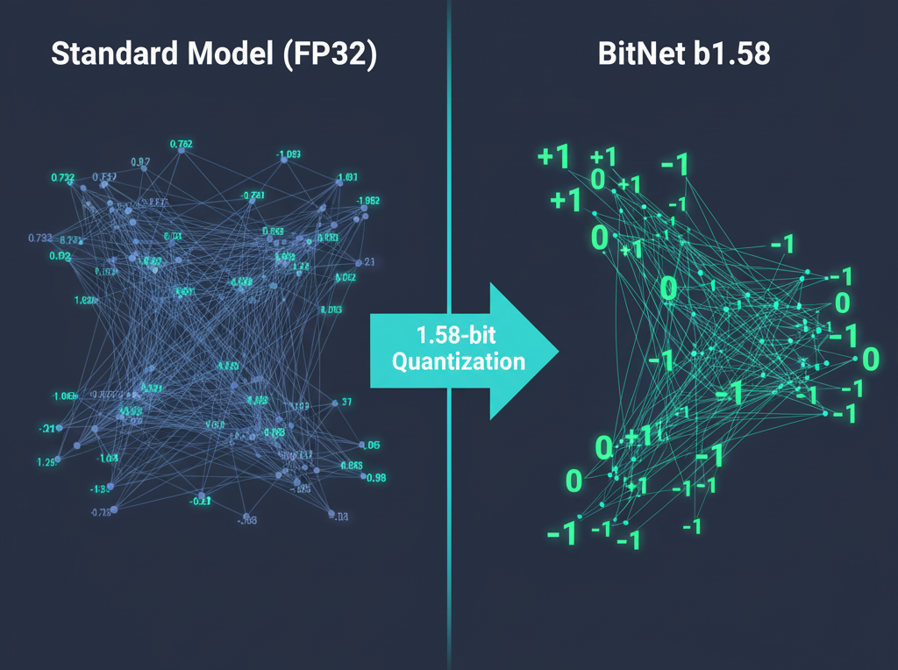
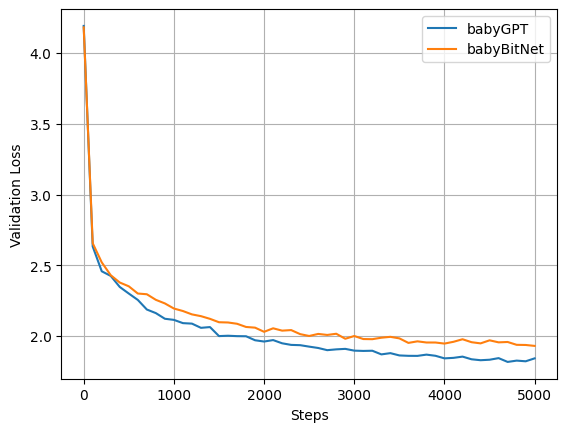

# babyBitNet



This repository is an implementation of the paper **"The Era of 1-bit LLMs: All Large Language Models are in 1.58 Bits"** by Ma et al.

The goal isn't a complete replication, but a version runnable on a small GPU (1080) to attempt verifying the paper's results on small transformer models built from scratch. This project is greatly inspired by Andrej Karpathy's video [Let's build GPT: from scratch, in code, spelled out](https://youtu.be/kCc8FmEb1nY?si=7eTlW5gbpFahsqnX).

## What is BitNet b1.58 ?

The original paper introduces **BitNet b1.58**, a Large Language Model where every single weight is constrained to one of three values: **-1, 0, or 1**. This has implications:

1.  **Reduced Memory :** Storing a weight requires only ~1.58 bits, leading to memory savings.
2.  **Faster Inference:** The most expensive operation in Transformers, matrix multiplication, becomes additions.
3.  **New Scaling Laws:** The paper shows that at a certain scale (3B parameters), BitNet b1.58 matches the performance of a full-precision model of the same size.

## Implementation Details

*   **`BitLinear` Layer:** A custom PyTorch `nn.Module` that implements the ternary weight quantization logic, including the Straight-Through Estimator for gradients.
*   **Modified Transformer Architecture:** A babyGPT model where all `nn.Linear` layers have been replaced by `BitLinear` layer.
*   **Comparison:** A notebook (`compare.ipynb`) to train both babyGPT and babyBitNet, allowing you to directly compare the training convergence (loss curves).

## Getting Started

### Prerequisites

*   Python
*   PyTorch
*   NumPy
*   Pandas

### Installation

```bash
git clone https://github.com/FouadLbakali/babybitnet.git
cd babybitnet
pip install -r requirements.txt
```

## Experiments and Results

Run the `compare.ipynb` notebook to see the direct comparison. Here's what you can expect to find:



The graph below shows the validation loss for both babyBitNet and the standard babyGPT on the Tiny Shakespeare dataset.

| Model | Learning Rate | Validation Loss
| :--- | :--- | :--- |
| **babyBitNet** | $9 \times 10^{-4}$ | ~1.93 |
| babyGPT | $1 \times 10^{-3}$ | ~1.84 |

On this small scale, we observe a performance trade-off, with the full-precision babyGPT achieving a lower validation loss. The original paper suggests that this performance gap will close as models get larger.

Our experiment uses the Tiny Shakespeare dataset (1 million characters), whereas the original paper uses a dataset containing 100 billion tokens. This difference in scale likely explains why we did not observe some training phenomena noted in the paper. For example, the original paper notes that BitNet b1.58 is more stable, allowing it to be trained with a higher learning rate. Furthermore, we did not observe the characteristic "S-shaped" learning curve described in the paper, nor did we see a performance improvement when reducing the learning rate mid-training. These phenomena are likely properties of training at a massive scale, which our small-scale experiment cannot reproduce.

## Future Work

*   Achieve true memory reduction by storing weights in a packed 2-bit format. Currently, the quantized weights are still stored as float32, so no memory is saved.
*   Write a custom CUDA kernel to accelerate the `BitLinear` forward pass by using only additions.
*   Implement a better architecture.
*   Train and evaluate the model on a larger dataset.
*   Investigate the performance in other stages of the LLM lifecycle, such as fine-tuning or reinforcement learning (GRPO).

## Acknowledgements

*   This project is inspired by the original **BitNet b1.58 paper** and its [FAQ](https://github.com/microsoft/unilm/blob/master/bitnet/The-Era-of-1-bit-LLMs__Training_Tips_Code_FAQ.pdf).
*   The code structure is based on Andrej Karpathy's [Let's build GPT: from scratch, in code, spelled out](https://youtu.be/kCc8FmEb1nY?si=7eTlW5gbpFahsqnX) video.

---